# SplitKeyboard

This is a split DIY custom keyboard loosely based on:
  * Ultimate Hacking Keyboard (interlocking ability)
  * General ten key less design
  * Preonic (I liked how the bottom row was nearly all 1u)

It is also interlocking with magnets to snap it together.
There are thumb arrow keys.
[See here for images](http://imgur.com/a/XaVwF)


**Table of Contents**  *generated with [DocToc](http://doctoc.herokuapp.com/)*


  - [How a split keyboard connects both halves](#how-a-split-keyboard-connects-both-halves)
    - [Basic concepts](#basic-concepts)
    - [Wiring between the two halves](#wiring-between-the-two-halves)
  - [Sourcing your parts](#sourcing-your-parts)
  - [Build guide](#build-guide])
    - [Designing and planning](#designing-and-planning)
    - [Putting it together](#putting-it-together)
      - [General assembly](#general-assembly)
      - [Wiring](#wiring)
  - [Custom firmware](#custom-firmware)
  
### How a split keyboard connects both halves
#### Basic concepts
While researching, I didn't find a comprehensive guide on split keyboard concepts.
These are the ways I learnt it could be done:
  * Having a controller (Teensy or an Arduino) in one half and an IO expander in the other half.
  * Having two controllers, one in each half which communicate via one of two protocols:
    * Serial or
	 * I2C
  * One controller and a bunch of wires between the halves

Controller + IO expander: The way the wiring in any keyboard works is that each row and each column is wired individually to a pin on somekind of controller. Say you have a controller with 20 available pins, your keyboard can have at most 100 keys as you can have 10 rows and 10 columns. If you want more keys, you use and IO expander. An IO expander has a bunch of pins for wiring the rows and columns to and a few special pins that are wired to the controller on the other half of the keyboard. Only two pins are used for communication between the IO expander and the Arduino. special pin condenses all the other pins and can pass all the information from the pins to the controller. So you can have a controller in one half and an IO expander in the other and have only a few wires between the two halves.

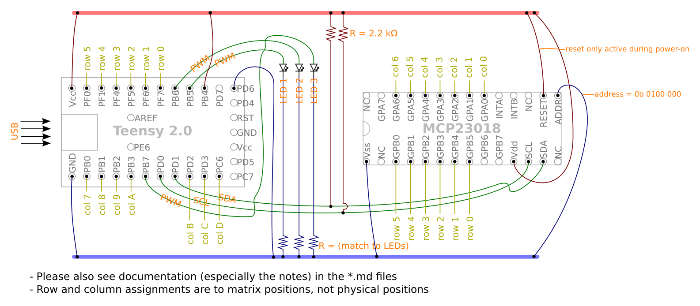

	
Two controllers: In this method, each half has a controller. The second controller (the one that isn't plugged directly into the computer) acts like a more versatile IO expander. I say more versatile because you can plug the secondary half into the computer or use both halves independently. It can act as a controller when you want it to. I believe that the firmware on the secondary half is used only to forward the signals on to the other half and the keymap that is on this secondary controller doesn't get used. But when you have it plugged into the computer separately, it runs the keymap that you programmed to it. So when it is being used as a secondary half it can behave in one way, but if you use it one its own, it might act as a numpad (or any other custom keymap).

If you have a controller in each half, you have to decide how they communicate with each other; what communication protocol do they use. I have learnt that the two main ones are Serial and I2C. Sparkfun does a great beginner friendly in depth look at them: [serial](https://learn.sparkfun.com/tutorials/serial-communication) and [I2C](https://learn.sparkfun.com/tutorials/i2c). On a side note, Sparkfun tells you a list of suggested topics before reading the chosen topic, so if you want to learn more about the electronics involved, start on Sparkfun. Without going in depth, the main differences are:
  * Serial uses 3 wires and I2C uses 4 (more about this in the next topic)
  * I2C is faster (but not noticeably because no one types that fast)

This is the method I used because an IO expander was going to be about the same cost as another Arduino. I also used serial just because it was easier working with 3 wires. Wiring for both serial and I2C can be found [here](#wiring)


The last (and least 'clean') method is just to have a lot of wires going between the sides. For instance, all the switches in a row on one side would be connected to a wire that goes between the halves and connects to all the switches on that half and then to the controller. 

The method you will affect the choice in wires that you have to make.
#### Wiring between the two halves
For the first two methods listed above, you will need a maximum of 4 wires:
  * One for ground
  * One for power
  * One/two for communication depending on protocol.

These are low power wires so pretty much any kind of cable can be used. A popular choice is an AUX cord. These are broken up into Tip Ring Sleeve (TRS, 3 internal wires) and Tip Ring Ring Sleeve (TRRS, 4 internal wires) cables: 

<p = align="centre">

</p>

You can identify them on eBay and other places by just looking at the pictures (3 notches or 4 notches). I went with a TRRS cable because I wasn't sure if I wanted to use I2C, but just go with TRS because there is wider variety of colours and more availability. If you want to be considered a pro mechanical keyboard user, get a braided cable that matches your keycap colour scheme :). You will also want a jack on either half of your keyboard so you can easily plug and unplug your cable and TRS jacks are a lot easier to find. Don't be fooled by jacks having 4 or 5 pins as 2 or 3 of them will be connected to the same part of your cable and are just extra pins. TRRS cables are compatible with TRS jacks. I would recommend getting a curly cable as it will look better and reduce clutter on your desk. After all, half of having a split mech keyboard is making your desk layout good (peep [mechanicalheadpens](https://www.reddit.com/r/mechanicalheadpens/))

You can use any other type of cable. I've seen SATA cables or RJ45 cables being used. You have to consider the height of the jack. If its too tall you'll have to make your case taller which isn't ideal. TRS jacks tend to be low profile and cheap which make them popular. My TRS jacks were still quite tall (8mm in a 9mm interior case) so if I were to design one again, I would use a USB C or micro USB breakout board: 
<p = align="centre">

</p>

If you want to not bother with those two methods and have many wires going inbetween the halves, I would recommend a ribbon cable. You can probably rip one out of an old computer or printer. It should enough wires for `Number of rows` + `Number of columns` + `2 for power`. I have never tried nor seen, but I think a USB C cable with a breakout board on either end would be quite elegant. USB C has 24 wires.


### Sourcing your parts

This is the shopping I had:
  * Materials:
    * 2 Arduino Pro Micros
    * 91 key switches
    * Stabilizers
    * Keycaps
    * 2 TRS jacks
    * 1 curly TRRS cable 
    * 91 1N4148 Diodes (200 pack)
    * 3 sheets of 400x300mm clear acrylic (3mm thick)
    * 24 2mm heigh, 4mm diameter magnets
    * 12 3mm nuts and bolts (20mm long)
    * A fair amount of solder
    * Around 2m of wire (thinner the better)
    * Extras:
      * Rubber feet
      * Nylon screws
    * If using I2C: 2 4.7kΩ pull up resistors
  * Tools:
    * Soldering iron with thin tip
    * Needle nose pliers come in handy

Everything I don't mention below, I bought on eBay.

I am living in Australia so I bought stabilizers and key switches from [mechkb.com](https://mechkb.com/). The key switches were 120 Gateron Browns. I would go for these ones if you are unsure because they are not too clicky but still have a satisfying tactile bump.

Keycaps were from [Banggood](https://www.banggood.com/) (white dual shot). I made sure that my key layout could be adapted from a standard 104 keyset. To do this I compared the summary table on [keyboard layout editor](http://www.keyboard-layout-editor.com/#/) for my keyboard and the standard 104 ANSI layout.

The choice of case material is important. The key switches are designed to snap into 1.5mm material. But 1.5mm acrylic is too floppy even when used in a half-keyboard wide case. I think the optimal material would be 1.5mm aluminium as steel of this thickness is said to be too hard and can fatigue your fingers. I used 3mm clear acrylic as the place where I laser cut it (explained in the build guide) had it in stock and wouldn't cut metal. Note that you will have to hot glue or secure the switches to the acrylic if using 3mm as I explain in the build guide. Don't worry if you want to rebuild your keyboard later because hot glue can easily be torn off the switches using some pliers. I have replaced a switch that was glued in and could easily get all the glue off the switch and the plate.

The guidance is different if you are using a PCB as the PCB holds the switches in place much better than a 3mm plate. I chose against using a PCB because: it was added cost; I would not have the option the modify or repair the keyboard easily; and it means more waiting time if you decide to order it.

This is how much it will cost:

| Items         | Cost (Aus Rupees)| Cost (USD) |
| ------------- |:-------------:   | ----------:|
| Arduinos      | 26               | 20         |
| Switches      | 56               | 43         |
| Stabilzers    | 11               | 8          |
| Keycaps       | 21               | 16         |
| TRS Jacks     | 4                | 3          |
| AUX Cable     | 5                | 4          |
| Diodes        | 8                | 6          |
| Acrylic       | 30               | 23         |
| Magnets       | 4                | 3          |
| Wire          | 5                | 4          |
| **Total**     | 170              | 129        |

I could have saved mainly on the Arduinos but I wanted some from inside Australia because I didn't want to wait forever and buy them from China. If you want you could also 3D print the keycaps and use MDF instead of acrylic.


### Build guide
#### Designing and planning
This was my favourite part of the process. Explore the subreddits, forums, and Pinterest and find designs that you like. Afterwards, got to [Keyboard Layout Editor](http://www.keyboard-layout-editor.com/#/). This website allows you to completely plan your keyboard layout either from scratch or from a preset. This is where you will find your summary table so that you know the sizes and number of keycaps you need. Also, under the raw data tab you will find the layout in an array. This is used by the next website, [SwillKB Builder](http://builder.swillkb.com/), to generate the case and switch plate. The website has its own detailed documentation in the blue question marks, but this is how each one of the options you need to fill in works:

1. Plate Layout: You copy and paste your raw data into the Plate Layout box. The raw data contains all the spacing and positions of the key switches which is used to generate the switch plate and size of the case.
2. Switch Type: The two main types of switches are Cherry and Alps. Gaterons are clones of Cherry's so just used type 1 (the square ones).
3. Stabilizers: There are two main types of stabilizers (used to stabilize keys >= 2u): Cherry and Costar. I used the Cherry + Costar type as I didn't know what to go with and this option allows both.
4. Case Type: You probably want sandwhich as this is custom made to your keyboard.
5. USB Cutout: I turned this off as I wanted one in each half. I edited the files afterwards and put one in each half.
6. Mount Holes: I turned this off as I used the polygon tool to have more control over where the holes should go.
7. Edge Padding: I used 4mm on all sides.
8. Plate Corners: What radius do you want the corners to be.
9. Custom Polygons: This allows you to put in custom shapes where you want. It's a good feature because editing 5 files afterwards can be a pain. I used their example to get nice looking mount holes that come out of the sides of the case.
10. Kerf: I didn't use this feature as I was laser cutting and the key switches were a good fit. 
11. Line Color: I didn't bother with this as I was going to edit the files afterwards. Some laser cutters use specific colours to know when to cut and when to engrave.
12. Line Weight: Some laser cutters will see the line as a rectangle that needs multiple passes if the line is too thick. I left this blank as I was going to edit the files after. 


The way I generated the files for my split keyboard was by making a [normal unsplit keyboard on KLE](http://www.keyboard-layout-editor.com/#/gists/94c5c17f0c58b8debc7f5c045de34edd) and on SwillKB Builder. I then used Inkscape to manually put in a line where I wanted the split to be. This way I could get a nice interlocking split keyboard.

I saved the files as SVG files as I knew how to edit them on Inkscape. The modifications I made to the case plans from SwillKB were:
1. Adding a line where I wanted the keyboard to be split. This made the acrylic quite thin near the split line but it was layered up so it was strong enough.

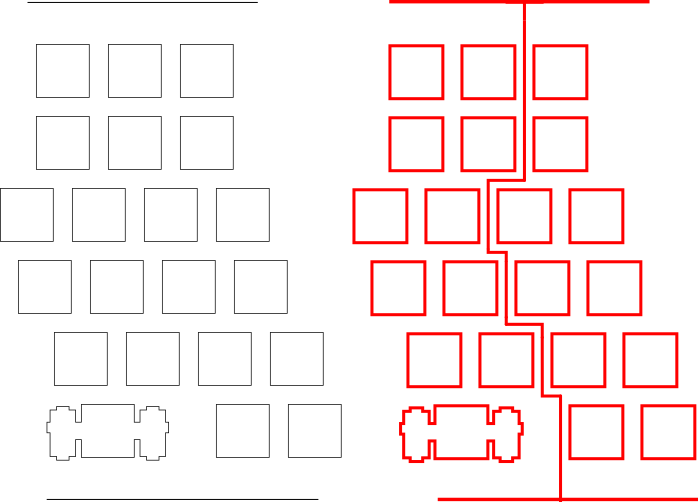

2. Adding more mount holes. I needed some more as I essentially cutout a segment between where the Arduino and the TRS jack.

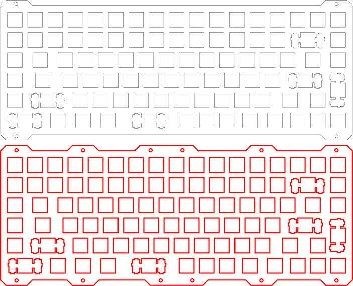

3. Adding little pockets for the magnets to fit in. I chose to have 6 magnets in pocket so that I would use all of the magnets that I bought. The magnets were to sit in the three middle layers, so I didn't modify the bottom and top layers for this step:

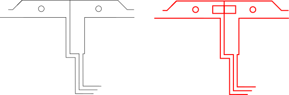

4. Adding cutouts on the necessary layers for the Arduino and TRS jack. The Arduino was 4mm thick I just modified the two lower middle layers. The TRS jack was 8mm thick so I modified all three middle layers.

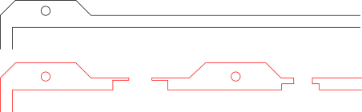

I planned my cutouts so that I could secure the TRS jack in place using the ring screw:

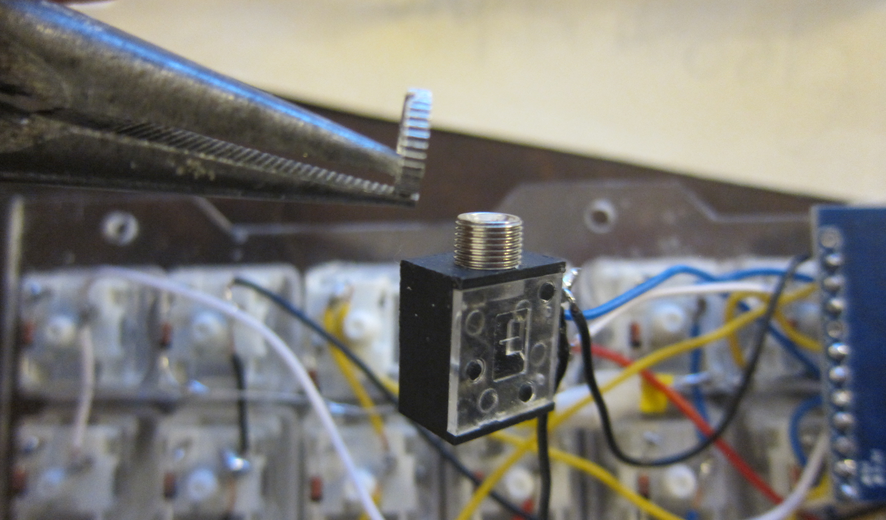

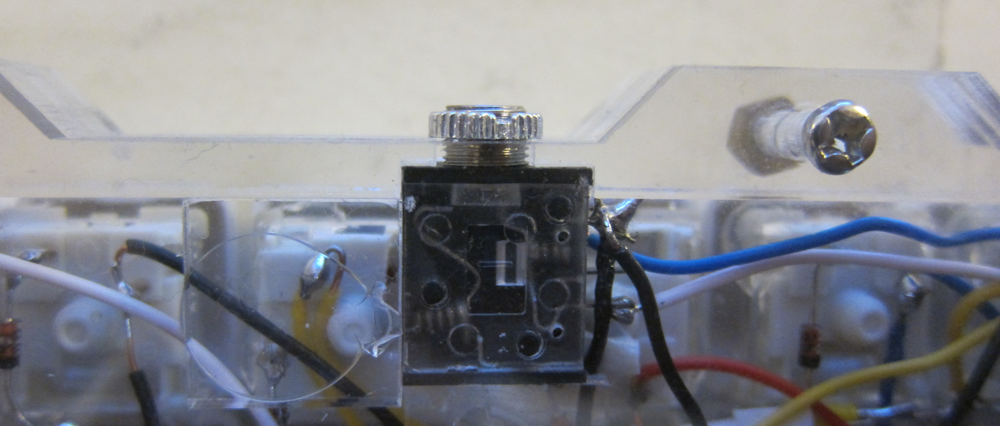

I laser cut the case at a FabLab. This a community diy centre with 3D printers and a laser cutter. The laser cutter was $5 per use and you could buy material there.

#### Putting it together
##### General assembly
I would follow [Matt3o's guide](https://deskthority.net/workshop-f7/brownfox-step-by-step-t6050.html) for the soldering and installation of the switches, and wiring of the controller.
Notes from this guide:
  * Use lots of hot glue when you secure the switches down because if you are pulling off keycaps, you don't want to pull off the key switch with it.
  * The orientation of the switches doesn't matter at all which comes in handy when you want to fit in a TRS jack. As the TRS jacks were quite tall they would have caused some got the switches to be pushed back up as there wasn't enough room for both the switches ans the jack. I had to cut part of the bottoms off two switches and rotate them a bit so that everything fitted in the case. There is quite a lot of unused space in the switches so you can cut nearly all the bottom plastic housing off without compromising functionality. Here you can see the switches that I cut:


  * I didn't use a micro USB cable inside the case as I didn't think it was necessary. The cable from the computer plugs directly into the case. As seen: 

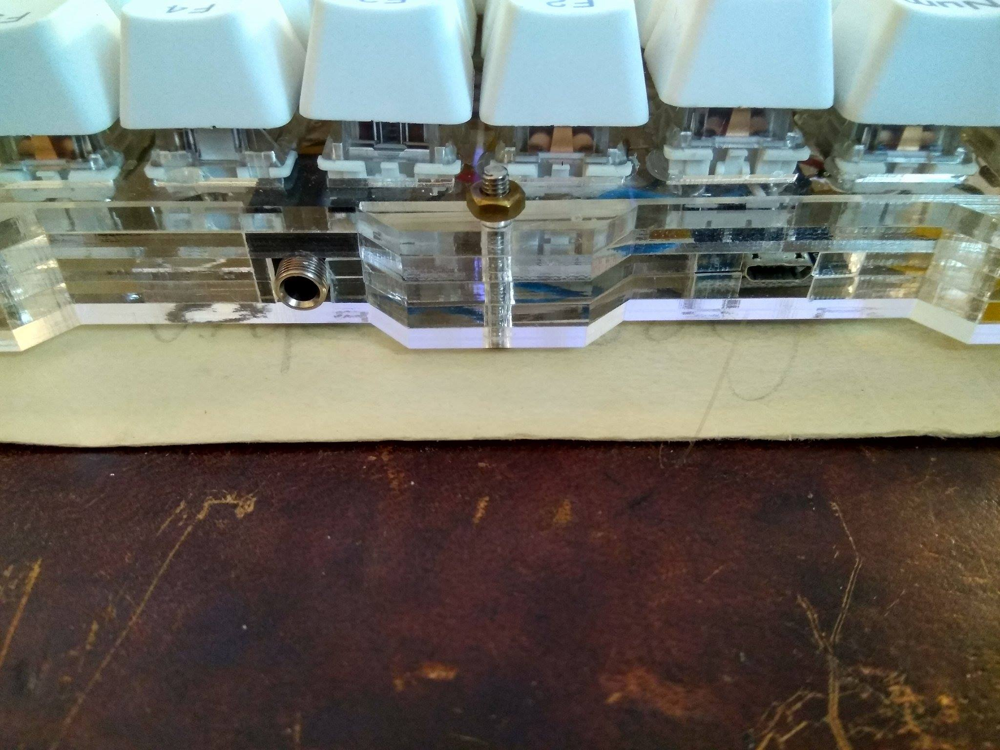

  * It is quite tight having the Arduino directly under the switches so keep your wires short and tidy. Otherwise like Matt3o, you can fit the controller under the space bar. I glued a couple of the acrylic switch cutouts to the bottom layer so that the Arduino would be held in place:

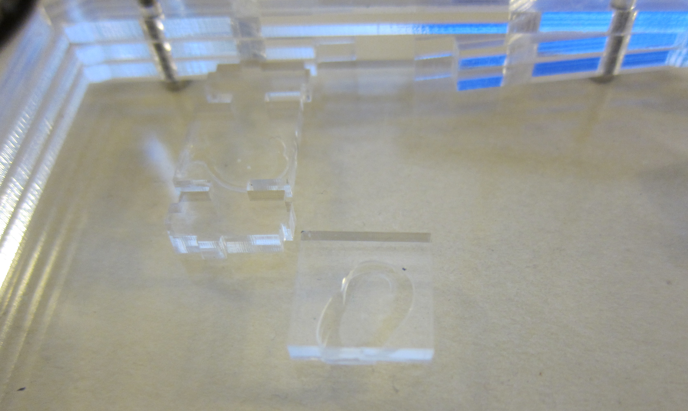

  * I soldered wires to the RST and GND pins and pushed the ends through the LED slot on the a switch near the edge of the keyboard. I hot glued them in place. This is so I can easily put the Arduino into bootloader mode. I will explain more about this in the firmware section. The ends of the wires is shown:


  * I was using magnets so that the two halves would stick together. I put some hot glue where the magnets should be and squished them in. As seen:

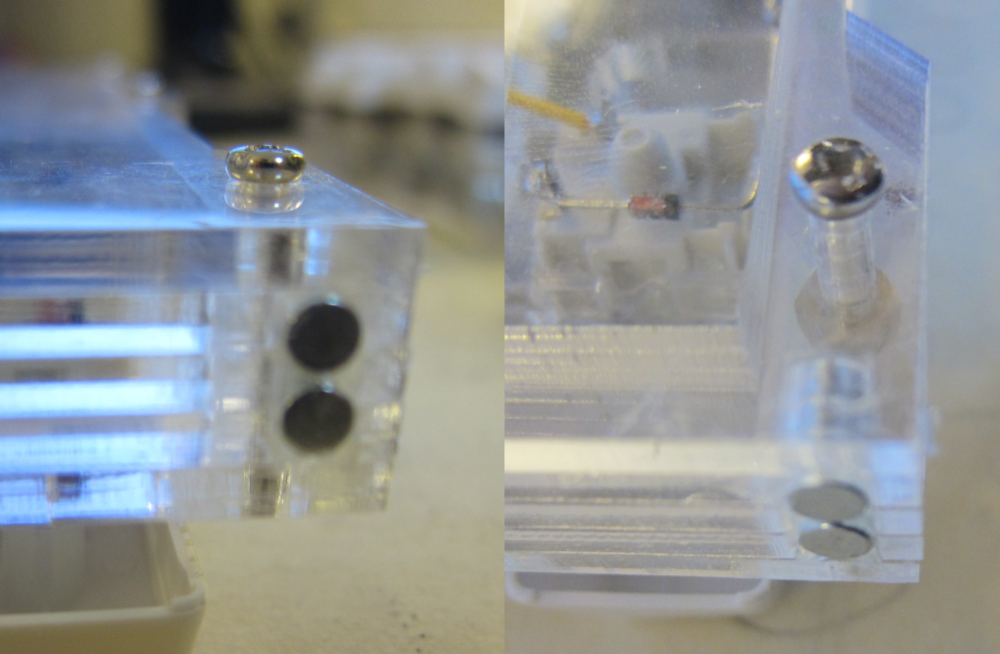

With the bits of the acrylic that were left over from the middle layers and some from a first prototype, I made a palmrest:


##### Wiring
I would first start by wiring the two halves together. This is the wiring for serial:


And this is the wiring for I2C:


You wire these wires to the pins on your jack and use the identical pins on the jack of the other half.

Then you can wire the columns and rows like Matt3o shows to any of the input / ouput pins. Searching for a pin out diagram for your controller will help:

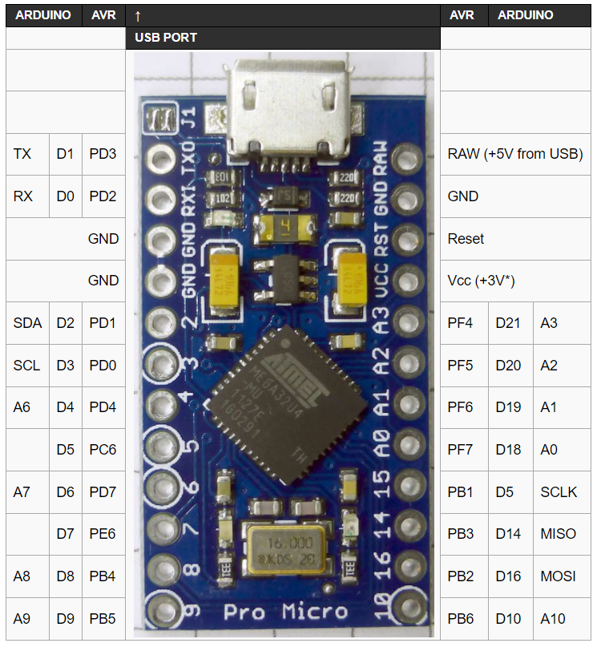

You don't have to use the exact same pins on the controller for each half, but it is easier if you do. I would make a table like this whilst you are wiring to your pins as you will use it later (Note: QMK pin naming (for example) uses B2 instead of PB2):

```
          ,------------------------------------------------------------------------------------------------------------------------------.
  PF5(A2) | Esc  | blkn |   f1 |   f2 |   f3 |  f4  |  f5  |  f6  |   no |  f7  |  f8  |   f9 | f10  |  f11 | f12  | voldn| volup| mute  | PD1
          |------+------+------+------+------+-------------+------+------+------+------+------+------+------+------+------+------+-------|
  PF6(A1) | blkn | grv  |   1  |    2 |    3 |   4  |   5  |   6  |   no |   7  |   8  |    9 |   0  |  -   |   =  | no   | bksp | del   | PF4
          |------+------+------+------+------+-------------+------+------+------+------+------+------+------+------+------+------+-------|
  PF7(A0) | blkn | tab  |   q  |    w |    e |   r  |   t  |   no |   no |   y  |   u  |    i |   o  |  p   |   [  |  ]   |   \  | prtsc | PF5
          |------+------+------+------+------+-------------+------+------+------+------+------+------+------+------+------+------+-------|
     PB1  | blkn | cpslk|   a  |    s |    d |   f  |   g  |   no |   no |   h  |   j  |    k |   l  |  ;   |   '  | no   | enter| no    | PF6
          |------+------+------+------+------+-------------+------+------+------+------+------+------+------+------+------+------+-------|
     PB3  | blkn |lshift|   z  |    x |    c |   v  |   b  |   no |   no |   n  |   m  |    , |   .  |  /   |   no |rshift| upar | blkn  | PF7
          |------+------+------+------+------+-------------+------+------+------+------+------+------+------+------+------+------+-------|
     PB2  | lctr | gui  |  alt | larr |   no |  spc |  no  |   no |   no | uparr| dwnar| rarr |  fn  |  no  | meta | larr | dwnar| rarr  | PB1
          `------------------------------------------------------------------------------------------------------------------------------'
             PD1    PD4     PC6   PD7    PE6    PB4    PB5    PB6     F4 |   PD4    PC6   PD7    PE6    PB4    PB5    PB6     PB2   PB3
```


RGB LED stuff: [this tutorial seems quite good](https://github.com/nicinabox/lets-split-guide/blob/master/rgb-underglow.md) but I never did RGB LED stuff.


### Custom firmware 

I used QMK for the firmware. The installation is well documented by [QMK](https://docs.qmk.fm/). I would read through the documentation as it will help a lot in understanding what is going on. It's very easy to use of you are using a kit as there are all the common kits (Ergodox, Let's Split). If you have an unsplit keyboard you can run the following command from root to get a new project setup:

`$ ./util/new_project.sh nameofnewproject`

But if you have a fully custom split, I would recommend modifying the Let's Split folder as I couldn't figure out how to add split functionality to the blank keymap. When modifying the Let's Split firmware there are a few files you need to edit:

  * /lets_split/keymaps/copyanotherkeymapfolder/config.h

    Here you can use `#define USE_SERIAL` or `#define USE_I2C`
  * /lets_split/keymaps/copyanotherkeymapfolder/keymap.c

    This is where you get to define all the layers you will have on your keyboard and what all the keys do. Read the [documentation](https://docs.qmk.fm/) if you haven't as this explains how to make a good keymap. Also there is an active subreddit [r/olkb](https://www.reddit.com/r/olkb/) if you have more questions.
  * /lets_split/rev2/config.h

    Edit the `#define MANUFACTURER` and other definitions to whatever you like.

    `#define MATRIX_ROWS` should be the number of total rows. e.g. 5 in the left and 7 in right would mean `#define MATRIX_ROWS 12`

    `#define MATRIX_COLUMNS` should be the number of total columns. e.g. 6 in the left and 7 in right would mean `#define MATRIX_COLUMNS 13`

    I used seperate pins in each half so when I built the firmware for the left side I would uncomment the first two lines and comment the last two:

    ```
    // #define MATRIX_ROW_PINS { F5, F6, F7, B1, B3, B2} //leftside
    // #define MATRIX_COL_PINS { D1, D4, C6, D7, E6, B4, B5, B6, F4 } //leftside
    #define MATRIX_ROW_PINS { D1, F4, F5, F6, F7, B1} //rightside
    #define MATRIX_COL_PINS { B3, B2, B6, B5, B4, E6, D7, C6, D4 } //rightside
    ```

  * /lets_split/rev2/rev2.h

    This file has definitions about the layout of the keyboard so that the keymap file can be used. The main thing to do is to change the definitions for KEYMAP or KC_KEYMAP so that it matches your layout (i.e. the correct number of rows and columns) or you will get errors when building.

All these files are located in the [lets_splitFirmware](./lets_splitFirmware/) folder if you want to look at them.

Once you have succesfully edited those files, it is time to build (AKA compile) your keymap. I would recommend making a `Makefile` file in your keymap directory like I have done [here](./lets_splitFirmware/keymaps/hfvoy/). This makes it easier to compile just your keymap and not all the others. The documnentation goes much more in depth about building using the `make` command. Go to your keymap directory and run the `make` command. This will either spew out errors that you need to deal with, or will create a `hex` file in the qmk root folder. Now that you have compiled your firmware, it is time to flash it.

When flashing the firmware onto the Arduino's, they must in "bootloader mode". The Arduino's can either run the program on them, or be in a mode where they rewrite their memory using whatever the computer passes them; this is bootloader mode. When you first buy an Arduino, they are in bootloader mode but when you want to re-flash them they need to be put back into bootloader mode. This is done by quickly connecting the RESET and GROUND pins. Some people to connect these pins to a small button and have that on the outside of the case. I chose to have two wires protruding through the LED slot on a switch. I can take the keycap off, and quickly connect the two wires. Much easier than having to disassemble the case to get to the Arduino. I re-flashed my Arduino's around 20 times so it's worth considering how you will short the two pins.

On Windows, I found the best program for flashing was AVRDUDESS. [This guide](https://gist.github.com/CampAsAChamp/e747d2b605c0c32923593b529f82ccdd) was great at explaining how to install and flash using AVRDUDESS.