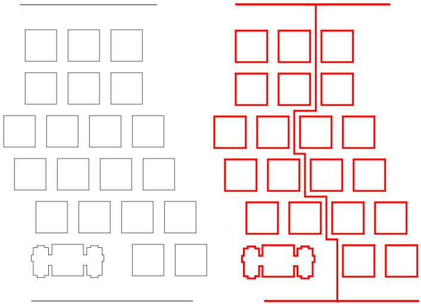

# SplitKeyboard

This is a split DIY custom keyboard loosely based on:
  * Ultimate Hacking Keyboard
  * General ten key less design
  * Preonic (I liked how the bottom row was nearly all 1u)
  
  
### How a split keyboard connects both halves
#### Basic concepts
While researching, I didn't find a comprehensive guide on split keyboard concepts.
These are the ways I learnt it could be done:
  * Having a controller (Teensy or an Arduino in one half) and an IO expander in the other half.
  * Having two controllers, one in each half which communicate via one of two protocols:
    * Serial or
	 * I2C
  * One controller and a bunch of wires between the halves

Controller + IO expander: The way the wiring works is that each row and each column is wired individually to a pin on somekind of controller. Say you have a controller with 20 available pins, your keyboard can have at most 100 keys as you can have 10 rows and 10 columns. If you want more keys, you use and IO expander. An IO expander has a bunch of pins for wiring the rows and columns to and a few special pins that are wired to the controller. This special pin condenses all the other pins and can pass all the information from the pins to the controller. So you can have a controller in one half and an IO expander in the other and have a only a few wires between the two halves.
	
Two controllers: In this method, each half has a controller. The second controller (the one that isn't plugged directyl into the computer) acts like a more versatile IO expander. I say more versatile because you can plug into the secondary half or use both halves indepently. It can act as a controller when you want it to. I believe that the firmware on the secondary half acts only as forwarding to signals on to the other half and the keymap that is on it doesn't get used. But when you have it plugged in seperately, it runs the keymap that you programmed to it. So when it is being used as a secondary half it can behave in one way, but if you use it one its own, it might act as a numpad (or any other custom keymap).
If you have a controller in each half, you have to decide how they communicate with each other; what communication protocol do they use. I have learnt that the two main ones are Serial and I2C. Sparkfun does a great beginner friendly in depth look at them: [serial](https://learn.sparkfun.com/tutorials/serial-communication) and [I2C](https://learn.sparkfun.com/tutorials/i2c). On a side note, Sparkfun tells you a suggested topics before reading the chosen topic, so if you want to learn more about the electronics involved, start on Sparkfun. Without going in depth, the main differences are:
  * Serial uses 3 wires and I2C uses 4 (more about this in the next topic)
  * I2C is faster (but not noticeably because no one types that fast)
This is the method I used because an IO expander was going to be about the same cost as another Arduino. I also used serial just because it was easier working with 3 wires.

The last (and probably worst) method is just to have a lot of wires going between the sides. For instance, all the switches in a row on one side would be connected to a wire that goes between the halves and connects to all the switches on that half and then to the controller. 

directand can be used independently. When they are not used independently a TRS jack on each half is used to connect a TRRS cable. TRRS cable is used as I may replace the TRS jacks with TRRS jacks to allow for I2C communication as 4 wires are required (TipRingSleeve only has three).

#### Wiring between the two halves
For the first two methods listed above, you will need a maximum of 4 wires:
  * One for ground
  * One for power
  * One/two for communication depending on protocol.
These are low voltage wires so pretty much any kind of cables can be used. A popular choice is an AUX cord. These are broken up into Tip Ring Sleeve (TRS, 3 internal wires) and Tip Ring Ring Sleeve (TRRS, 4 internal wires) cables: 
You can identify them on eBay and other places by just looking at the pictures (3 notches or 4 notches). I went with a TRRS cable because I wasn't sure if I wanted to use I2C, but just go with TRS because there is wider variety of colours and more availability. If you want to be considered a pro mechanical keyboard user, get a braided cable that matches your keycap colour scheme :). You will also want a jack on either half of your keyboard so you can easily plug and unplug your cable and TRS jacks are a lot easier to find. Don't be fooled by jacks having 4 or 5 pins as 2 or 3 of them will be connected to the same part of your cable and are just extra pins. TRRS cables are compatible with TRS jacks. I would recommend getting a curly cable as it will look better and reduce clutter on your desk. After all, half of having a split mech keyboard is making your desk layout good (peep [mechanicalheadpens](https://www.reddit.com/r/mechanicalheadpens/))
You can use any other type of cable. I've seen SATA cables or RJ45 cables being used. You have to consider the height of the jack. If its too tall you'll have to make your case taller which isn't ideal. TRS jacks tend to be low profile and cheap which make them popular.

If you want to not bother with those two methods and have many wires going inbetween the halves, I would recommend a ribbon cable. You can probably rip one out of an old computer or printer.

### Sourcing your parts

This is the shopping I had:
  * Materials:
    * 2 Arduino Pro Micros
    * 91 key switches
    * Stablizers
    * Keycaps
    * 2 TRS jacks
    * 1 curly TRRS cable 
    * 91 Diodes (200 pack)
    * 3 sheets of 400x300mm clear acrylic (3mm thick)
    * 24 2mm heigh, 4mm diameter magnets
    * 12 3mm nuts and bolts (20mm long)
    * A fair amount of solder
    * Around 2m of wire (thinner the better)
    * Extras:
      * Rubber feet
      * Nylon screws
  * Tools:
    * Soldering iron with thin tip
    * Needle nose pliers come in handy

Everything I don't mention below, I bought on eBay.
I am living in Australia so I bought stablizers and key switches from [mechkb.com](https://mechkb.com/). The key switches were 120 Gateron Browns. I would go for these ones if you are unsure because they are not too clicky but still have a satisfying tactile bump.
Keycaps were from [Banggood](https://www.banggood.com/) (white dual shot). I made sure that my key layout could be adapted from a standard 104 keyset. To do this I compared the summary table on [keyboard layout editor](http://www.keyboard-layout-editor.com/#/) for my keyboard and the standard 104 ANSI layout.
The choice of case material is important. The key switches are designed to snap into 1.5mm material. But 1.5mm acrylic is too floppy even when used in a half-keyboard wide case. I think the optimal material would be 1.5mm aluminium as steel of this thickness is said to be too hard and can fatigue your fingers. I used 3mm clear acrylic as the place where I laser cut it (explained in the build guide) had it in stock and wouldn't cut metal. Note that you will have to hot glue or secure the switches to the acrylic if using 3mm as I explain in the build guide. Don't worry if you want to rebuild your keyboard later because hot glue can easily be torn off the switches using some pliers. I have replaced a switch that was glued in and could easily get all the glue off the switch and the plate.
The guidance is different if you are using a PCB as the PCB holds the switches in place much better than a 3mm plate. I chose against using a PCB because: it was added cost; I would not have the option the modify or repair the keyboard easily; and it means more waiting time if you decide to order it.

This is how much it will cost:

| Items         | Cost (Aus Rupees)| Cost (USD) |
| ------------- |:-------------:   | ----------:|
| Arduinos      | 26               | 20         |
| Switches      | 56               | 43         |
| Stabilsers    | 11               | 8          |
| Keycaps       | 21               | 16         |
| TRS Jacks     | 4                | 3          |
| AUX Cable     | 5                | 4          |
| Diodes        | 8                | 6          |
| Acrylic       | 30               | 23         |
| Magnets       | 4                | 3          |
| Wire          | 5                | 4          |
| **Total**     | 170              | 129        |

I could have saved mainly on the Arduinos but I wanted some from inside Australia because I didn't want to wait forever and buy them from China. If you want you could also 3D print the keycaps and use MDF instead of acrylic.

### Build guide
#### Designing and planning
This was my favourite part of the process. Explore the subreddits, forums, and Pinterest and find designs that you like. Afterwards, got to the [Keyboard Layout Editor](http://www.keyboard-layout-editor.com/#/). This website allows you to completely plan your keyboard layout either from scratch or from a preset. This is where you will find your summary table so that you know the sizes and number of keycaps you need. Also, under the raw data tab you will find the layout in an array. This is used by the next website, [SwillKB Builder](http://builder.swillkb.com/), to generate the case and switch plate. The website has its own detailed documentation in the blue question marks, but this is how each one of the options you need to fill in works:
1. Plate Layout: You copy and paste your raw data into the Plate Layout box. The raw data contains all the spacing and positions of the key switches which is used to generate the switch plate and size of the case.
2. Switch Type: The two main types of switches are Cherry and Alps. Gaterons are clones of Cherry's so just used type 1 (the square ones).
3. Stablizers: There are two main types of stabilizers (used to stablize big keys): Cherry and Costar. I used the Cherry + Costar type as I didn't know what to go with and this option allows both.
4. Case Type: You probably want sandwhich as this is custom made to your keyboard.
5. USB Cutout: I turned this off as I wanted one in each half. I edited the files afterwards and put one in each half.
6. Mount Holes: I turned this off as I used the polygon tool to have more control over where the holes should go.
7. Edge Padding: I used 4mm on all sides.
8. Plate Corners: What radius do you want the corners to be.
9. Custom Polygons: This allows you to put in custom shapes where you want. It's a good feature because editing 5 files afterwards can be a pain. I used their example to get nice looking mount holes that come out of the sides of the case.
10. Kerf: I didn't use this feature as I was laser cutting and the key switches were a good fit. 
11. Line Color: I didn't bother with this as I was going to edit the files afterwards. Some laser cutters use specific colours to know when to cut and when to engrave.
12. Line Weight: Some laser cutters will see the line as rectangle that needs multiple passes if the line is too thick. I left this blank as I was going to edit the files after. 

The way I generated the files for my split keyboard was by making a normal unsplit keyboard on KLE and on SwillKB Builder. I then used Inkscape to manually put in a line where I wanted the split to be. This way I could get a nice interlocking split keyboard.

I saved the files as SVG files as I knew how to edit them on Inkscape. The modifications I made to the case plans from SwillKB were:
1. Adding a line where I wanted the keyboard to be split. This made the acrylic quite thin near the split line but it was layered up so it was strong enough.

2. Adding more mount holes. I needed some more as I essentially cutout a segment between where the Arduino and the TRS jack.

3. Adding little pockets for the magnets to fit in. I chose to have 6 magnets in pocket so that I would use all of the magnets that I bought. The magnets were to sit in the three middle layers, so I didn't modify the bottom and top layers for this step:

4. Adding cutouts on the necessary layers for the Arduino and TRS jack. The Arduino was 4mm thick I just modified the two lower middle layers. The TRS jack was 8mm thick so modified all three middle layers.

wip for the actual pictures and further steps.

### Custom firmware 
wip